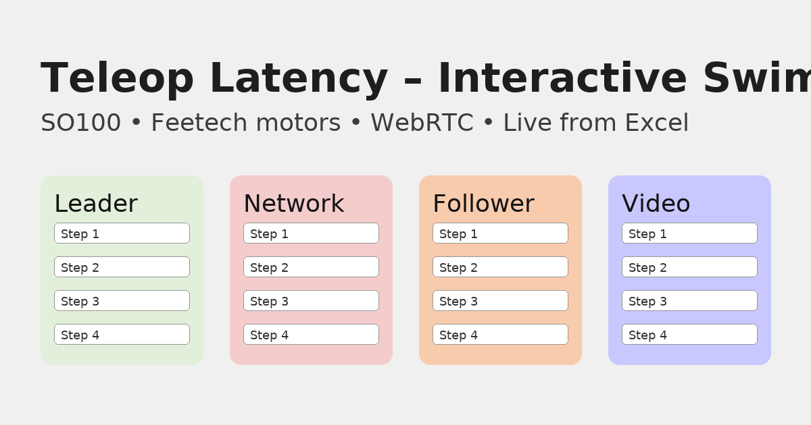

# Teleop Latency Diagram

> **CI status:** 

Swimlane-diagram generator voor een SO100↔SO100 teleoperatieketen (Python USB-serial, WebRTC op Jetson).
Leest **Inputs** uit een Excel-model en bouwt een **Command→Photon** flow met totaaltijden.

## Snel starten

```bash
python -m venv .venv && source .venv/bin/activate  # Windows: .venv\Scripts\activate
pip install -r requirements.txt
# Zorg dat het Graphviz 'dot' programma is geïnstalleerd (Linux: apt-get install graphviz, macOS: brew install graphviz, Windows: choco install graphviz)
python src/make_swimlane_from_excel.py examples/Teleop_Latency_Model_SO100_WebRTC_v3.xlsx out.png Typical
```

- `Best|Typical|Worst|Selected` mogelijk als derde argument (default **Typical**).
- Gebruik **Selected** als je Excel de gekozen scenario-kolom laat uitrekenen in de ‘Selected’ kolom (vereist recalculatie in Excel).

## Projectstructuur

```
.
├── src/
│   └── make_swimlane_from_excel.py
├── examples/
│   └── Teleop_Latency_Model_SO100_WebRTC_v3.xlsx
├── .github/workflows/
│   └── ci.yml
├── requirements.txt
├── Makefile
├── LICENSE
├── .gitignore
└── README.md
```

## CI (GitHub Actions)

- Installeert Python + Graphviz
- Voert het script uit op het voorbeeld-Excel
- Publiceert het **PNG-diagram als build-artifact**

## Licentie

MIT

## Website (GitHub Pages)


De interactieve site (D3) wordt automatisch gebouwd uit het Excel-bestand en via GitHub Pages gedeployed.

**Na push:**
1. Ga naar *Settings → Pages* en kies *GitHub Actions* als bron (of laat de workflow dit afhandelen).
2. De site staat op: `https://OWNER.github.io/REPO/` (vervang koenvanwijk/latency).





## Live Excel uit Google Sheets / Drive

Je kunt CI automatisch jouw Excel van Google laten halen. Zet een **publish/export**-link in een repo **Variable** of **Secret** met naam `INPUT_XLSX_URL`:

- **Google Sheets (Publish to web → XLSX)**:  
  `https://docs.google.com/spreadsheets/d/{SHEET_ID}/export?format=xlsx`
  - Specifieke tab: `...&gid=0`
- **Google Drive (bestand-ID)**:  
  Publiek: `https://drive.google.com/uc?export=download&id={FILE_ID}`

**Instellen in GitHub:**
1. Ga naar _Settings → Secrets and variables → Actions_.
2. Voeg **Variables** of **Secrets** toe: `INPUT_XLSX_URL` met jouw export-URL.
3. Trigger de workflow (push of _Run workflow_) of wacht op de **hourly** Pages-run.

> De workflows valideren: als `INPUT_XLSX_URL` leeg is, gebruiken ze het voorbeeldbestand.
